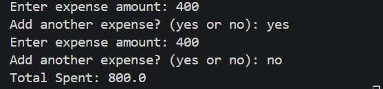

# 💰 Expense Tracker

A simple **Console-Based Expense Tracker** built with Python as part of my Python internship at **DECODE Labs**.

The project allows users to enter multiple expense amounts and calculates the **Total Spent**.

## 🚀 Features

- 💵 Enter expense amounts
- ➕ Add multiple expenses together
- 📊 Calculate the total amount spent
- 🖥️ Simple console-based interface

## 🛠️ Technology Used

- **Python 3**

## 🧠 Concepts Practiced

This project helped me practice fundamental Python concepts:

- Variables
- `input()`
- `float()`
- `while` loops
- Mathematical operations
- Accumulators
- User input
- Basic data processing

## 🔄 How It Works

The program starts the total at zero:

```python
total = 0
````

The user enters an expense amount:

```python
new_expense = float(input("Enter expense amount: "))
```

The expense is then added to the running total:

```python
total = total + new_expense
```

The program continues accepting expenses until the user chooses to stop.

Finally, it displays the total amount spent:

```python
print("Total Spent:", total)
```

## 📸 Output



## ▶️ How to Run

Make sure Python is installed on your computer.

Open the project folder in VS Code and run:

```bash
python expense_tracker.py
```

Enter your expense amounts when prompted.

## 📌 Example

```text
Enter expense amount: 100
Add another expense? (yes or no): yes

Enter expense amount: 50
Add another expense? (yes or no): yes

Enter expense amount: 20
Add another expense? (yes or no): no

Total Spent: 170.0
```

## 🎯 Learning Objective

The main objective of this project was to understand **mathematical operations and accumulators** by continuously adding expense values and processing numerical data.

## 👩‍💻 Internship Project

**Python Internship — DECODE Labs**

This project is part of my learning journey as a Python Intern, where I am developing practical projects to strengthen my programming and problem-solving skills.

output is linked .s

